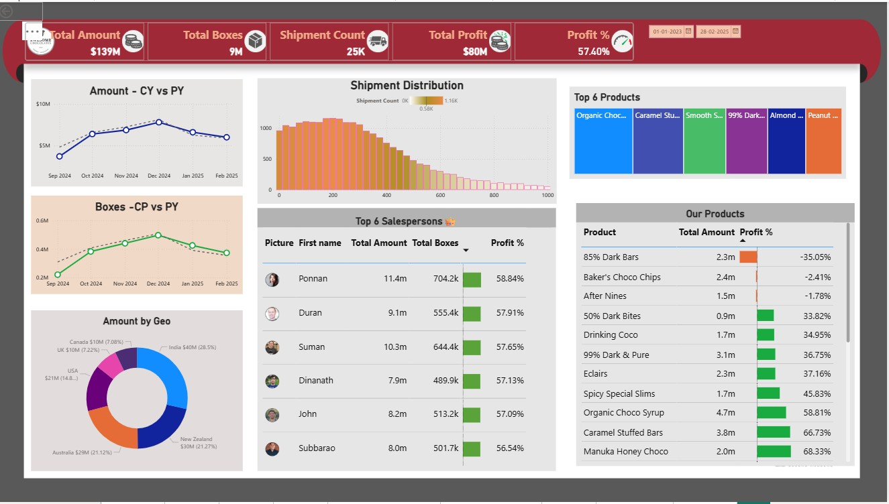

# 🍫 Chocolate Sales & Shipments Dashboard | Power BI

## 📌 Overview

An interactive **Chocolate Sales and Shipments Dashboard built using Microsoft Power BI** to analyze sales performance, shipments, boxes sold, profit, products, salespeople, and geographical performance.

The dashboard provides a consolidated view of key business KPIs along with year-over-year and product-level analysis.

## 🎯 Objective

- Analyze overall sales and profit performance
- Track shipment and box volumes
- Compare current-year and previous-year performance
- Identify top-performing products
- Analyze sales performance by geography
- Compare salespeople based on sales, boxes, and profit
- Analyze product-level profitability
- Monitor shipment distribution

## 📂 Dataset

The project uses the `sample-chocolate-shipments-data-all-Apr-2025 (3).xlsx` dataset.

The dataset contains shipment, product, geography, salesperson, and date-related information used to analyze sales and profitability.

Key information includes:

- Shipment details
- Salesperson information
- Product information
- Geography
- Shipment date
- Sales amount
- Boxes sold
- Profit
- Product cost
- Calendar and date attributes

## 🛠️ Tools & Technologies

- **Microsoft Power BI**
- **Power Query**
- **DAX**
- **Microsoft Excel**
- **Data Visualization**
- **Data Analysis**

## 📊 Dashboard Highlights

### Key KPIs

- **Total Amount:** $139M
- **Total Boxes:** 9M
- **Shipment Count:** 25K
- **Total Profit:** $80M
- **Profit %:** 57.40%

### Analysis Included

- Amount – CY vs PY
- Boxes – CP vs PY
- Shipment Distribution
- Amount by Geography
- Top 6 Products
- Top 6 Salespersons
- Product-level Amount and Profit %
- Date-based performance analysis

## 🔍 Key Insights

- The dashboard reports **$139M in total sales amount** and approximately **$80M in total profit**.
- The overall displayed **profit percentage is 57.40%**.
- The dashboard represents approximately **9M boxes** across **25K shipments**.
- **India** has the highest displayed sales amount among the geographies shown.
- Sales performance is compared between the **current year and previous year**.
- The salesperson analysis compares individuals based on **Total Amount, Total Boxes, and Profit %**.
- Product-level analysis shows considerable variation in profitability across different chocolate products.
- The shipment distribution visual provides an overview of shipment volumes across the analyzed range.

## 📸 Dashboard Preview



## 📁 Repository Files

```text
Chocolate-Sales-PowerBI/
│
├── README.md
├── Old PBI.pbix
├── sample-chocolate-shipments-data-all-Apr-2025 (3).xlsx
└── dashboard.jpg
